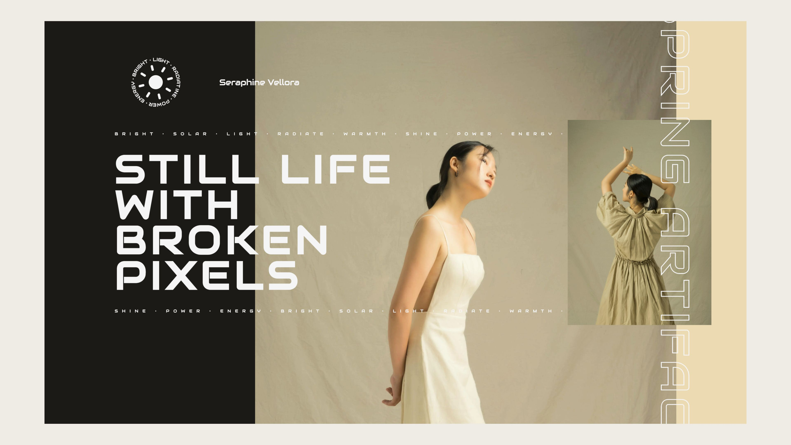

# Seraphine Vellora

A sleek, minimal landing page that blends editorial elegance with modern digital aesthetics.

---

## ✨ Features

- Clean, layout-driven design  
- Responsive and mobile-friendly  
- Bold typography and visual balance  
- Built using HTML, CSS, and JavaScript  

---

## 🔗 Live Preview

- [View Website](https://milanxcode.github.io/Seraphine-Vellora/)  

---

## 🛠 Tech Stack

- HTML5  
- CSS3  
- JavaScript  

---

## 📸 Screenshots

---

## 💡 Inspiration

Where digital meets editorial — inspired by soft tones, serene fashion layouts, and the beauty of broken symmetry.

